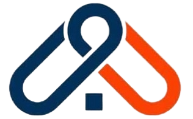

# Synergex Solutions - Complete Website with CMS



**Tagline:** Turning Waste Into Sustainable Value

A fully dynamic, professional website with complete Content Management System (CMS) for Synergex Solutions - a sustainability-driven enterprise focused on plastic waste recycling and eco-friendly product manufacturing.

## 📋 Table of Contents
- [Features](#features)
- [Technology Stack](#technology-stack)
- [System Requirements](#system-requirements)
- [Installation Guide](#installation-guide)
  - [Localhost Setup](#localhost-setup)
  - [cPanel Deployment](#cpanel-deployment)
- [File Structure](#file-structure)
- [Configuration](#configuration)
- [Usage Guide](#usage-guide)
- [Admin Panel Features](#admin-panel-features)
- [Troubleshooting](#troubleshooting)
- [Security](#security)

## ✨ Features

### Frontend Features
✅ Responsive, mobile-first design  
✅ Dynamic content from database  
✅ Product catalog with pricing  
✅ Interactive cost calculator  
✅ Image gallery with categories  
✅ Achievement timeline  
✅ Contact form  
✅ Newsletter subscription  
✅ Quote request system  
✅ WhatsApp integration  
✅ SEO-friendly structure  

### Admin CMS Features
✅ Secure admin login with session management  
✅ Dashboard with statistics  
✅ Product management (CRUD)  
✅ Gallery management with image upload  
✅ Achievement management  
✅ Quote request tracking  
✅ Contact message inbox  
✅ Newsletter subscriber management  
✅ Site settings editor  
✅ Impact statistics control  
✅ Partner management  

## 🛠 Technology Stack
- **Backend:** PHP 8.0+ with PDO
- **Database:** MySQL 5.7+ / MariaDB
- **Frontend:** HTML5, CSS3, JavaScript (ES6+)
Design: Custom CSS with Google Fonts
Architecture: MVC-inspired structure
Security: Password hashing, prepared statements, CSRF protection
## 💻 System Requirements

### Minimum Requirements
- **Web Server:** Apache 2.4+ with mod_rewrite
- **PHP:** 7.4 or higher (8.0+ recommended)
- **MySQL:** 5.7+ or MariaDB 10.3+
- **PHP Extensions:**
  - PDO
  - PDO_MySQL
  - GD Library (for image processing)
  - mbstring
  - JSON
- **Disk Space:** 100MB minimum
- **Memory:** 128MB PHP memory limit

### Recommended for Production
- **PHP:** 8.0 or higher
- **SSL Certificate:** Let's Encrypt or commercial
- **Memory:** 256MB+ PHP memory limit
- **Backup System:** Automated daily backups

## 📦 Installation Guide

### Localhost Setup (XAMPP/WAMP)

#### Step 1: Clone or Download
```bash
cd C:\xampp\htdocs  # or your web server root
git clone https://github.com/MUMAR-TECH/synergex.git
cd synergex
```

#### Step 2: Create Database
1. Open phpMyAdmin: http://localhost/phpmyadmin
2. Create database: `synergex_db`
3. Import `synergex_db.sql`

#### Step 3: Configure Environment
1. Copy `.env.example` to `.env`
2. Update database credentials:
```env
DB_HOST=localhost
DB_NAME=synergex_db
DB_USER=root
DB_PASS=
SITE_URL=http://localhost/synergex
APP_ENV=development
APP_DEBUG=true
SESSION_COOKIE_SECURE=false
```

#### Step 4: Create Admin Account
1. Visit: http://localhost/synergex/admin/setup.php
2. Create your admin account
3. **Delete setup.php immediately after!**

#### Step 5: Test
- Homepage: http://localhost/synergex
- Admin: http://localhost/synergex/admin

### cPanel Deployment

**📚 For detailed cPanel deployment instructions, see:**
- **[QUICK_DEPLOY.md](QUICK_DEPLOY.md)** - Fast 35-minute deployment checklist
- **[CPANEL_DEPLOYMENT.md](CPANEL_DEPLOYMENT.md)** - Comprehensive deployment guide
- **[LOCALHOST_VS_CPANEL.md](LOCALHOST_VS_CPANEL.md)** - Environment differences explained

#### Quick cPanel Steps:

1. **Create Database** (cPanel → MySQL Databases)
   - Database name will be: `username_synergex_db`
   - Create user with strong password
   - Grant ALL PRIVILEGES

2. **Import Database** (phpMyAdmin)
   - Select your database
   - Import `synergex_db.sql`

3. **Upload Files** (Git or File Manager)
   ```bash
   # Via Git (recommended)
   cPanel → Git Version Control → Clone Repository
   
   # Via File Manager
   Upload all files to public_html
   ```

4. **Create .env File** (CRITICAL!)
   ```env
   # Create this file manually on cPanel - NEVER commit to Git!
   DB_HOST=localhost
   DB_NAME=username_synergex_db     # ← Your actual database name
   DB_USER=username_dbuser          # ← Your database user
   DB_PASS=your_password            # ← Your database password
   SITE_URL=https://synergexsol.com # ← Your domain with HTTPS
   APP_ENV=production
   APP_DEBUG=false
   SESSION_COOKIE_SECURE=true
   ```

5. **Install SSL Certificate** (cPanel → SSL/TLS)
   - Use Let's Encrypt (free)
   - Verify HTTPS works

6. **Create Admin Account**
   - Visit: https://yourdomain.com/admin/setup.php
   - Create account
   - **DELETE setup.php immediately!**

7. **Verify Deployment**
   - Upload `verify-deployment.php` from repository
   - Visit: https://yourdomain.com/verify-deployment.php
   - Check all items pass
   - **DELETE verify-deployment.php after use!**

#### Common cPanel Issues

| Issue | Solution |
|-------|----------|
| HTTP 500 Error | Check `.env` file exists and is valid |
| Database Connection Failed | Verify database name includes username prefix |
| Redirect Loop | Already fixed - clear browser cookies |
| Can't Upload Images | Set `uploads/` permissions to 755 |

See [LOCALHOST_VS_CPANEL.md](LOCALHOST_VS_CPANEL.md) for complete troubleshooting guide.

## 📁 File Structure
synergex/
│
├── 📄 config.php                    # Configuration file
├── 📄 database.sql                  # Database schema
├── 📄 README.md                     # This file
│
├── 📄 index.php                     # Homepage
├── 📄 about.php                     # About page
├── 📄 what-we-do.php               # Services page
├── 📄 products.php                  # Products & calculator
├── 📄 achievements.php              # Achievements timeline
├── 📄 gallery.php                   # Image gallery
├── 📄 vision-sdgs.php              # Vision & SDGs page
├── 📄 contact.php                   # Contact form
│
├── 📁 admin/                        # Admin panel
│   ├── 📄 index.php                # Admin login
│   ├── 📄 dashboard.php            # Admin dashboard
│   ├── 📄 products.php             # Manage products
│   ├── 📄 gallery.php              # Manage gallery
│   ├── 📄 achievements.php         # Manage achievements
│   ├── 📄 quotes.php               # Quote requests
│   ├── 📄 messages.php             # Contact messages
│   ├── 📄 subscribers.php          # Newsletter subscribers
│   ├── 📄 settings.php             # Site settings
│   ├── 📄 logout.php               # Logout
│   └── 📁 includes/
│       ├── 📄 admin_header.php     # Admin header
│       └── 📄 admin_footer.php     # Admin footer
│
├── 📁 includes/                     # Shared includes
│   ├── 📄 db.php                   # Database class
│   ├── 📄 functions.php            # Helper functions
│   ├── 📄 header.php               # Site header
│   └── 📄 footer.php               # Site footer
│
├── 📁 api/                          # API endpoints
│   ├── 📄 quote.php                # Quote API
│   ├── 📄 contact.php              # Contact API
│   └── 📄 subscribe.php            # Subscribe API
│
└── 📁 assets/                       # Static assets
    ├── 📁 css/
    │   ├── 📄 style.css            # Main stylesheet
    │   └── 📄 admin.css            # Admin stylesheet
    ├── 📁 js/
    │   ├── 📄 main.js              # Frontend JavaScript
    │   └── 📄 admin.js             # Admin JavaScript
    └── 📁 images/
        ├── 📄 logo.png             # Site logo
        └── 📁 uploads/             # User uploads (CHMOD 777)
🔑 Default Credentials
Admin Panel Access:

URL: http://yourdomain.com/synergex/admin/
Email: admin@synergex.com
Password: Admin@123
⚠️ IMPORTANT: Change the admin password immediately after first login!

⚙️ Configuration
config.php Settings
php
// Database
define('DB_HOST', 'localhost');
define('DB_NAME', 'synergex_db');
define('DB_USER', 'root');
define('DB_PASS', '');

// Site URLs
define('SITE_URL', 'http://localhost/synergex');
define('ADMIN_URL', SITE_URL . '/admin');

// WhatsApp
define('WHATSAPP_NUMBER', '260770377471');
define('WHATSAPP_MESSAGE', 'Hello Synergex! I would like to know more.');

// Upload Paths
define('UPLOAD_PATH', __DIR__ . '/assets/images/uploads/');
define('UPLOAD_URL', SITE_URL . '/assets/images/uploads/');

// Timezone
date_default_timezone_set('Africa/Lusaka');
📖 Usage Guide
Adding Products
Login to admin panel
Navigate to "Products"
Click "Add New Product"
Fill in product details:
Name
Description
Price (ZMW)
Unit (e.g., "per unit")
Features (separated by |)
Upload image
Set active status
Click "Save Product"
Managing Gallery
Go to "Gallery" in admin
Click "Add New Image"
Upload image
Add title and caption
Select category
Set display order
Save
Updating Impact Statistics
Go to "Settings"
Find "Impact Statistics" section
Update values:
Plastic Recycled (kg)
Eco-Pavers Produced
Institutions Served
Youths Engaged
Click "Update Statistics"
Processing Quote Requests
Go to "Quote Requests"
View pending quotes
Click on a quote to see details
Update status (Pending, Responded, Completed)
Optional: Export to CSV
🎛 Admin Panel Features
Dashboard
Overview statistics
Recent quote requests
Recent messages
Quick access links
Product Management
Add/Edit/Delete products
Upload product images
Manage pricing
Set active/inactive status
Gallery Management
Upload images
Organize by category
Add captions
Reorder images
Quote Management
View all quote requests
Update status
Contact information
Export data
Message Management
View contact messages
Mark as read/unread
Respond to messages
Subscriber Management
View email list
Export subscribers
Manage status
Settings
Update site information
Edit contact details
Manage impact statistics
Configure integrations
🔧 Troubleshooting
Database Connection Errors
Error: "Connection failed: Access denied"

Solution:

php
// Verify credentials in config.php
define('DB_USER', 'correct_username');
define('DB_PASS', 'correct_password');
Image Upload Issues
Error: "Failed to upload image"

Solution:

bash
# Check permissions
chmod 777 assets/images/uploads/

# Check PHP upload limits in php.ini
upload_max_filesize = 10M
post_max_size = 10M
Blank Admin Pages
Error: White screen or blank page

Solution:

php
// Enable error reporting in config.php
error_reporting(E_ALL);
ini_set('display_errors', 1);

// Check PHP error logs
tail -f /var/log/apache2/error.log
404 Errors on Pages
Error: Pages not found

Solution:

apache
# Ensure mod_rewrite is enabled
sudo a2enmod rewrite
sudo service apache2 restart

# Check .htaccess file exists
🔒 Security
Best Practices
Change Default Password
Login immediately and change admin password
Use strong password (12+ characters, mixed case, numbers, symbols)
File Permissions
bash
   # Recommended permissions
   chmod 644 *.php
   chmod 755 assets/images/uploads/
   chmod 600 config.php
Database Security
sql
   -- Create dedicated database user
   CREATE USER 'synergex_user'@'localhost' IDENTIFIED BY 'strong_password';
   GRANT SELECT, INSERT, UPDATE, DELETE ON synergex_db.* TO 'synergex_user'@'localhost';
   FLUSH PRIVILEGES;
HTTPS
Always use HTTPS in production
Update config.php: define('SITE_URL', 'https://yourdomain.com/synergex');
Disable Error Display
php
   // In production, set in config.php:
   error_reporting(0);
   ini_set('display_errors', 0);
Regular Updates
Keep PHP and MySQL updated
Monitor security advisories
Regular security audits
💾 Backup & Maintenance
Database Backup
Manual Backup:

bash
mysqldump -u root -p synergex_db > backup_$(date +%Y%m%d).sql
Automated Daily Backup (Cron):

bash
# Add to crontab (crontab -e)
0 2 * * * mysqldump -u root -pYourPassword synergex_db > /backups/synergex_$(date +\%Y\%m\%d).sql
File Backup
bash
# Backup entire directory
tar -czf synergex_backup_$(date +%Y%m%d).tar.gz /path/to/synergex/

# Backup only uploads
tar -czf uploads_backup_$(date +%Y%m%d).tar.gz assets/images/uploads/
Restore Database
bash
mysql -u root -p synergex_db < backup_20250101.sql
Maintenance Tasks
Weekly:

Review quote requests
Check error logs
Test contact forms
Verify image uploads
Monthly:

Update impact statistics
Review and archive old data
Database optimization:
sql
  OPTIMIZE TABLE products, quote_requests, contact_messages;
📞 Support
Contact Information
Email: synergexsolutions25@gmail.com
Phone: 0770377471
WhatsApp: +260770377471
Documentation
PHP Manual: https://www.php.net/docs.php
MySQL Documentation: https://dev.mysql.com/doc/
Common Issues
Forgot Admin Password
sql
   -- Reset password (Admin@123)
   UPDATE admin_users 
   SET password = '$2y$10$92IXUNpkjO0rOQ5byMi.Ye4oKoEa3Ro9llC/.og/at2.uheWG/igi' 
   WHERE email = 'admin@synergex.com';
Database Connection
Verify MySQL is running: sudo service mysql status
Check credentials in config.php
Test connection: mysql -u username -p
Permission Errors
bash
   # Fix ownership
   sudo chown -R www-data:www-data /path/to/synergex/
   
   # Fix permissions
   find /path/to/synergex -type d -exec chmod 755 {} \;
   find /path/to/synergex -type f -exec chmod 644 {} \;
   chmod 777 assets/images/uploads/
🚀 Deployment Checklist
Before going live:

 Change admin password
 Update config.php with production URL
 Set up HTTPS/SSL certificate
 Disable error display
 Set secure file permissions
 Create database backup
 Test all forms
 Test image uploads
 Verify calculator works
 Check mobile responsiveness
 Set up automated backups
 Configure email (SMTP)
 Test WhatsApp integration
 Review security settings
 Set up monitoring/logging
📄 License
This project is proprietary software developed for Synergex Solutions.

🙏 Credits
Developed for: Synergex Solutions
Design: Based on Synergex brand guidelines
Fonts: Google Fonts (Inter, Montserrat)
Icons: Unicode Emoji

📌 Version
Current Version: 1.0.0
Release Date: December 2024
Last Updated: December 17, 2024

Built with ❤️ for a sustainable Zambia

# synergex

